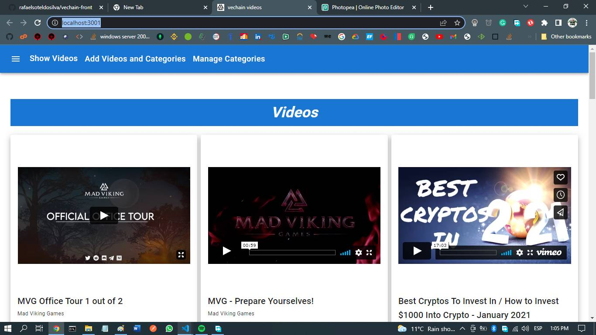
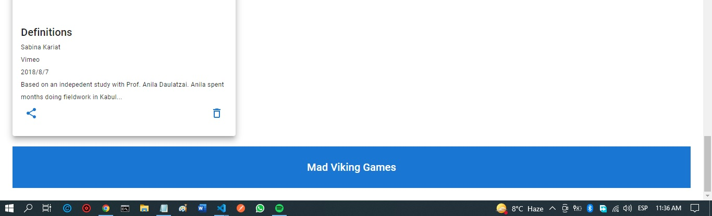

# **vechain-front**

Date: december 2021

Author: Rafael Soteldo

Main technologies used: React, redux, material-ui, React Router Dom, Consuming Api

---



---

This app is the frontend for vechain-back

It's purpose is internal use, to manage the videos that will be shown in a future project

It is not finished in it's functionality

It shows a series of videos, in the meantime, they are preloaded into the database, for development, but in the future, it should be whatever video the users load into the DB

The purpose is to have a page that shows videos, for different purposes, like recent jobs, news about NFT, etc.

This app allows company users to load videos, delete them, show them in relation to a video category, set the order of the video categories to be shown in the final interface (in the future), add and delete video categories, etc.

Each video shown in the screen, include a social media button, that will let users to share a video in social media, and a delete button, that marks the video to be deleted. The selected videos can be deleted with the use of the left Drawer.

The user is presented with a Show Videos page, an Add Videos and Categories page, and manage Categories Page


It is structured as follows:

-  src folder, contains most of the logic of the app,
-  src/components folder, contains components used by the app's pages
-  src/pages folder, contains the pages of the app
-  src/redux folder, contains the redux logic
-  src/redux/actions folder, contains the actions creators for the redux state reducers
-  src/redux/reducers folder, contains the reducers for the redux state
-  src/redux/stores folder, configures the redux store
-  App.js, it puts everything toguether,
-  index.js, inserts the app into the root element

The files will be explained as they appear in the project


## **The components folder**

This folder contains components used by the app's pages:

## <ins>components/Dialogs</ins>

Contains the dialogs used in the app:

-  ConfirmDeletionOfCategoryWithVideos.js, and
-  CreateCategory.js

## <ins>components/Footer.js</ins>

Shows the app's footer



## <ins>components/NavBar.js</ins>

Shows the app's Navigation Bar. This component is invoked by the component `MainPage.js`


When there are marked videos for deletion, the nav bar alerts the user


It is done with the use of material ui badge:

```jsx
// src/components/NavBar.js
<Badge badgeContent={selectedVideos.length === 0 ? 0 : "Check"} color="error">
   <MenuIcon className={classes.menuButton} />
</Badge>
```

The `menuIcon` is 

## <ins>components/mainPage.js</ins>

This component wraps all page invocations. It is in charge of invoking the navBar and the footer for every page

```jsx
// App.js
...
<Route
   path="/manageCategories"
   element={<MainPage render={() => <ManageCategories />} />}
/>
...
```

It makes the left drawer, the app header and the app footer available for the user interface, all the time

```jsx
   return (
      <React.Fragment>
         <PersistentLeftDrawer
            ...
         />
         <Main
            open={drawerOpen}
            sx={{ marginLeft: `${marginLeftWhenDrawerOpens}px` }}
         >
            <Grid container direction="column">
               <Grid item>
                  <NavBar
                     ...
                  />
               </Grid>
                  ...
               <Grid item container>
                  {render()}
               </Grid>
               <Grid item>
                  <Footer />
               </Grid>
            </Grid>
         </Main>
      </React.Fragment>
   );
```


## <ins>components/PersistentLeftDrawer.js</ins>

Once there are videos marked for deletion, the NavBar alerts the user  and shows two options:

-  Delete Selected
-  Reset Selected

As the selected videos for deletion have their own redux state, they are available for all app's components, including the drawer

Everytime ShowVideosWithVideoCategoryBreaks.js is rendered, it rebuilds the drawerItemsList, checking for selectedVideos.length, if it's > 0, it enables the item, otherwise, it disables it

```jsx
// src/Pages/ShowVideosWithVideoCategoryBreaks.js
useEffect(() => {
   resetDrawerMenuItems();

   let newMenuItem = { ...drawer.menuItemModel };
   newMenuItem.text = "Delete selected";
   newMenuItem.icon = <DeleteForeverIcon />;
   newMenuItem.disabled = selectedVideos.length === 0 ? true : false;
   newMenuItem.onClick = deleteSelectedVideos;
   addDrawerMenuItem(newMenuItem);

   newMenuItem = { ...drawer.menuItemModel };
   newMenuItem.text = "Reset selected";
   newMenuItem.icon = <DeleteSweepIcon />;
   newMenuItem.disabled = selectedVideos.length === 0 ? true : false;
   newMenuItem.onClick = performResetSelectedVideos;
   addDrawerMenuItem(newMenuItem);
});
```

PersistentLeftDrawer shows these items, as menuItems, they carry with themselves all the information, the text, the icon, if it's disabled or not, and the onClick function, be it `deleteSelectedVideos()` or `performResetSelectedVideos()`. All the information is used when building the list of items:

```jsx
// src/components/PersistentLeftDrawer.js
{
   drawerItems.map((item, index) =>
      item.divider ? (
         <Divider key={index} />
      ) : (
         <ListItem disablePadding key={index} disabled={item.disabled}>
            <ListItemButton onClick={item.onClick}>
               {item.icon && <ListItemIcon>{item.icon}</ListItemIcon>}
               <ListItemText primary={item.text} />
            </ListItemButton>
         </ListItem>
      )
   );
}
```

These two items are always present, disabled or not.

The onClick is item.onClick, which was set in `ShowVideosWithVideoCategoryBreaks.js`

It is called Persistent because once opened, it remains so until is closed by the user

For building this component, I followed the material ui guidelines on the subject https://mui.com/material-ui/react-drawer/

## <ins>components/Videocard.js</ins>

It is in charge of displaying a video card, with the video's title, the video's category, the video's thumbnail, the video's description, the video's date, the video's social media buttons, and the video's delete button

```jsx
return (
   <React.Fragment>
      <Card elevation={8}>
         <CardContent
            className={classes.entireItem}
            // if the selectedVideos include this url, then change its backGroundColor to lightGray
            style={changeCurrentVideoBackgroundColor(url)}
         >
            // Show a player for this video
            <ReactPlayer
               url={url}
               // Show the video controls
               controls={true}
               // Occupy the entire space of the card
               width={"100%"}
               // this light property, shows an image instead of the video
               // light={girl}
               //
            />
            <Box>
               <Typography
                  // this variant will make the text a little bigger
                  variant="h6"
                  // As the component is span, it is build upon span properties, display inline...
                  component="span"
                  // display title in bold
                  sx={{ fontWeight: "bold" }}
               >
                  {title}
               </Typography>
            </Box>
            ...
         </CardContent>
      </Card>
   </React.Fragment>
);
```

## **The DBActionsNoRedux folder**

This folder would contain all request gto the api, not associated to redux

## <ins>DBActionsNoRedux/axiosRequests.js</ins>

This code returns the promise delivered by `axios.get()`

```jsx
// src/DBActionsNoRedux/axiosRequests.js
export function consultIfCategoryHasVideos(categoryName) {
   let apiUrl =
      "http://localhost:3000/api/v1/videoCategories/hasVideos/" + categoryName;
   return axios.get(apiUrl);
}
```

This endpoint is defined in vechain-back.

It will be invoked by `src\Pages\ManageCategories.js` when the user wants to delete a category, it checks if the category has videos, in that case a dialog is shown (`src/Dialogs/confirmDeletionOfCategoryWithVideos.js`)

```jsx
// src/Pages/ManageCategories.js
function deleteCategoryRow(name) {
   consultIfCategoryHasVideos(name)
      .then((res) => {
         setCategoryNameToConfirmDeletion(name);
         setConfirmDeletionDialogOpen(!confirmDeletionDialogOpen);
      })
      .catch((error) => {
         deleteCategory(name);
      });
}
```

The reason for this behavior is that the deletion of a category will delete all the videos that belong to that category (SQL onDelete CASCADE)

```jsx
// vechain-back/src/db/models/video.js
...
Video.associate = function (models) {
   Video.belongsTo(models.VideoCategory, {
      foreignKey: "videoCategoryId",
      onDelete: "CASCADE",
   });
};
```

## **The Pages folder**

This folder contains the actual pages the app has routes for

```jsx
// App.js
...
<Route path="/manageCategories" element={<MainPage render={() => <ManageCategories />} />} />
...
```

The pages are:

-  AddVideosAndCategories.js
-  ManageCategories.js
-  ShowVideosWithVideoCategoryBreaks.js

## <ins>Pages/AddVideosAndCategories.js</ins>


It is a form that takes the info of a new video, and adds it to the database.

The form is a controlled one, and enables the submit button if all fields are filled in and there are no errors.

The field url is checked against a regular expression:

```jsx
// src/components/AddVideosAndCategories.js
var validUrlRegEx =
   /https?:\/\/(www\.)?[-a-zA-Z0-9\@:%._\+~#=]{1,256}\.[a-zA-Z0-9()]{1,6}\b([-a-zA-Z0-9()\@:%_\+.~#?&//=]*)/;
```

The upload date is required to be less or equal to today's date

The user has to select a category from the list (which are in the categories redux state), if it doesn't exist, the user has the option to create it


These are the default appearances of material ui fields

The calendar field for the uploadDate:


The rest are required to be non-null
